# ***Section1***
# 1) How to Import Servlet Project 
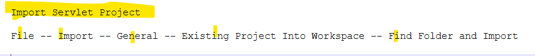
```
*********************************
*********************************
```
# ***Section2***
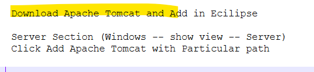
```
*********************************
*********************************
```
# ***Section-3: Web Application Basics***
# 1) Web App Basics
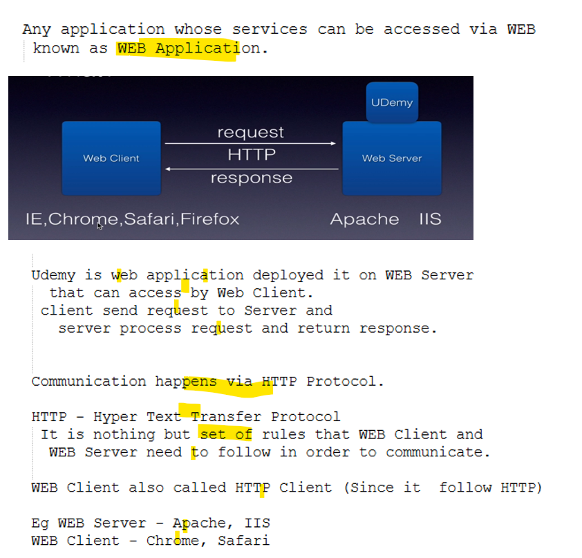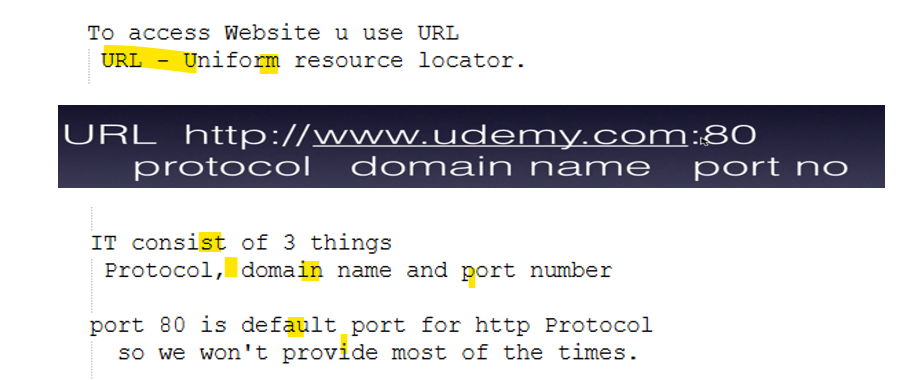
# 2) Static vs Dynamic WEB Application
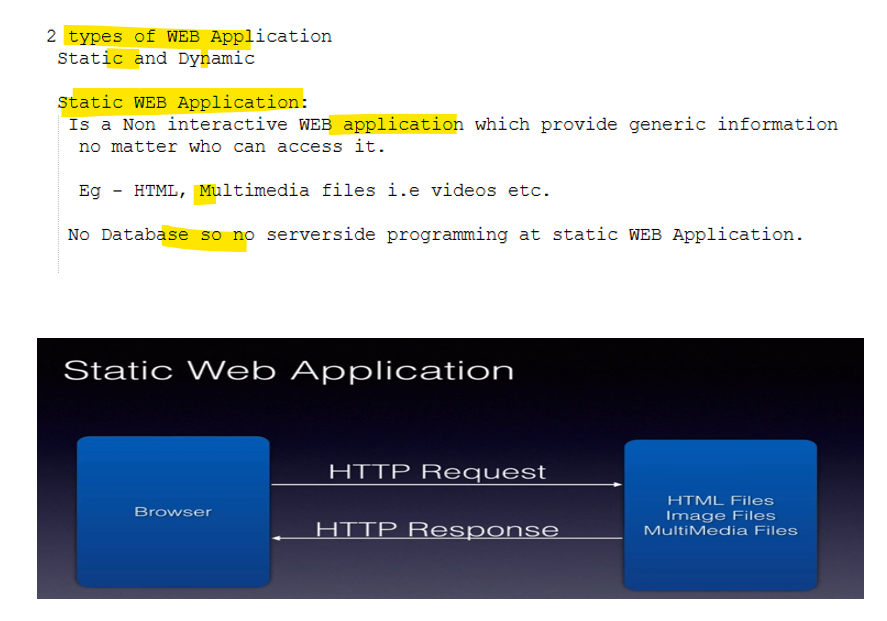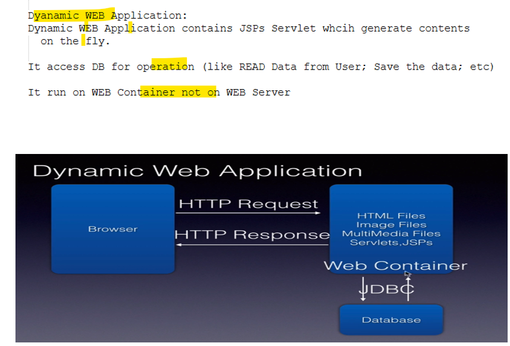
# 3) Server Side programming
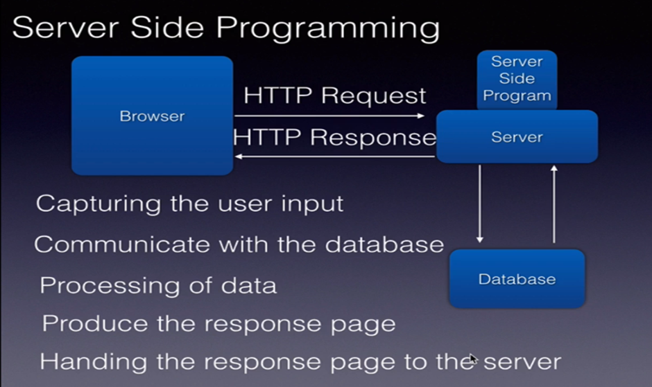
```
*********************************
*********************************
```
# ***Section-4: Servlet Basics***
# 1) Lifecyle of Servlet
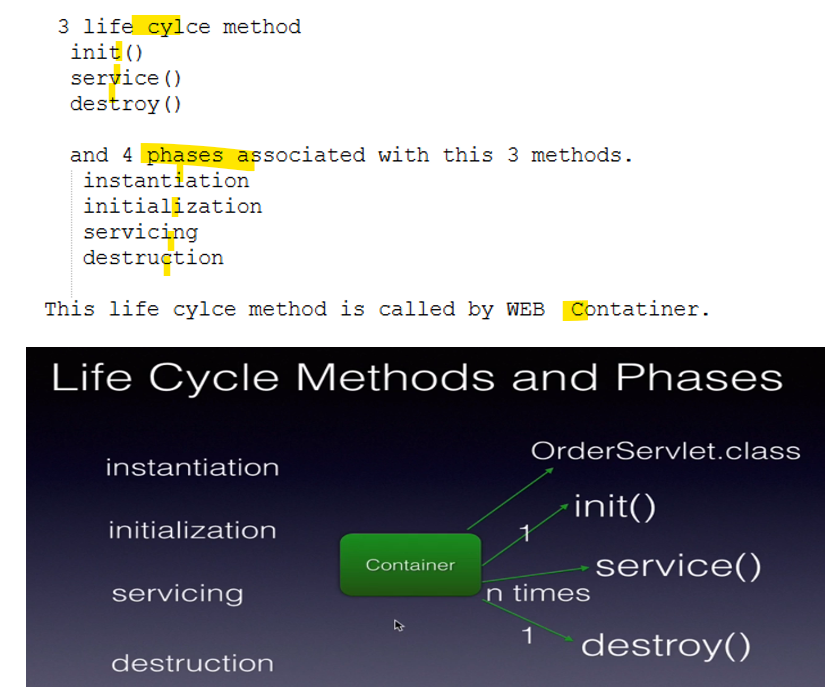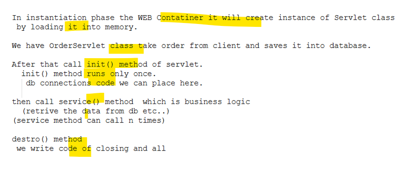
# 2) Folder Structure
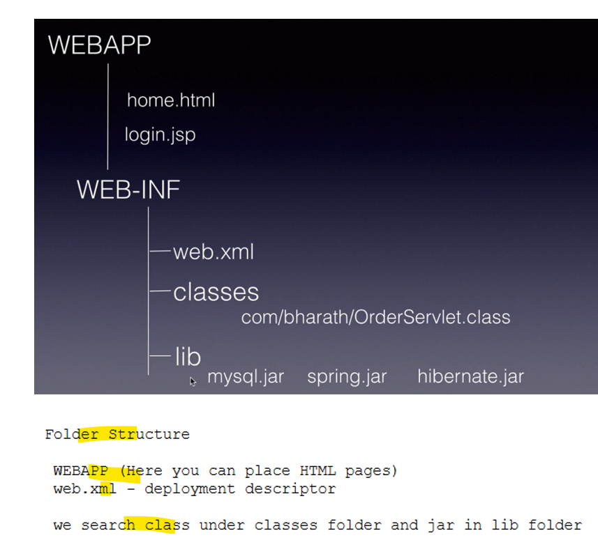
# 3) What are Servlets?
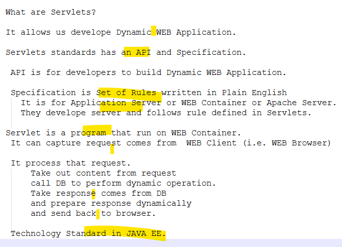
# 4) Servlet Annotation
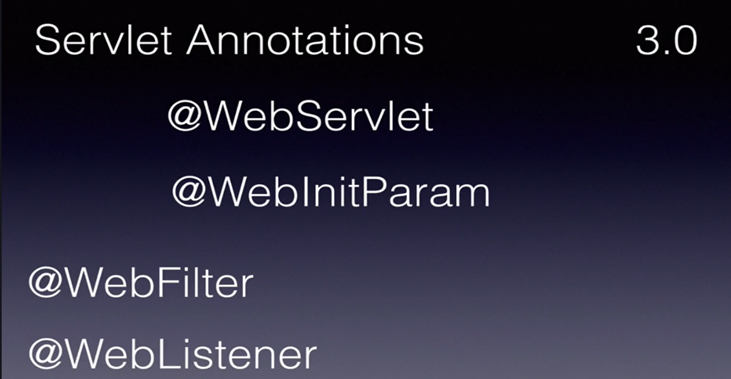
- With annotation configuration becomes easy.
- Currently jakarta ee packages are there instead of Java EE
# 5) Hello World Project Creation.
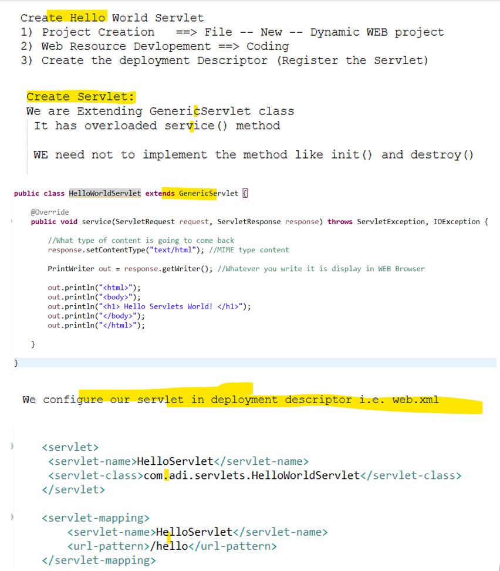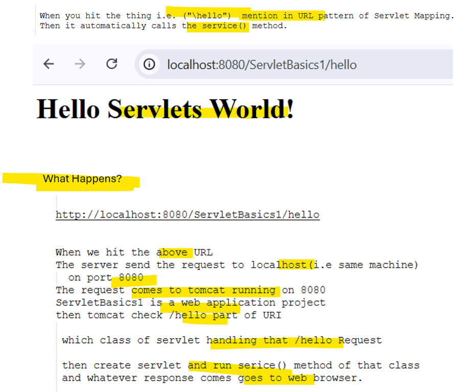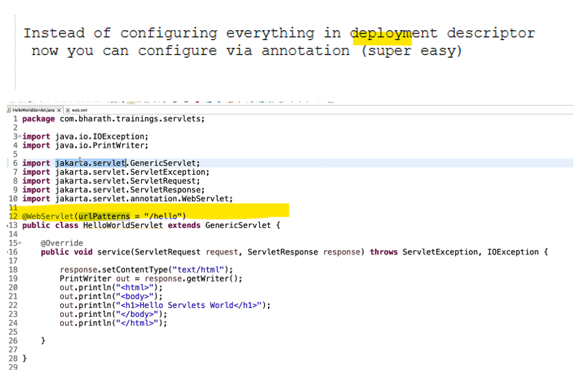
##
```java
public class HelloWorldServlet extends GenericServlet {

	@Override
	public void service(ServletRequest request, ServletResponse response) throws ServletException, IOException {
		  
		//What type of content is going to come back
		response.setContentType("text/html"); //MIME type content 
		
		PrintWriter out = response.getWriter(); //Whatever you write it is display in WEB Browser
		
		out.println("<html>");
		out.println("<body>");
		out.println("<h1> Hello Servlets World! </h1>");
		out.println("</body>");
		out.println("</html>");

	}
}
```
## 
```xml
<?xml version="1.0" encoding="UTF-8"?>
<web-app id="WebApp_ID" version="2.4" xmlns="http://java.sun.com/xml/ns/j2ee" xmlns:xsi="http://www.w3.org/2001/XMLSchema-instance" xsi:schemaLocation="http://java.sun.com/xml/ns/j2ee http://java.sun.com/xml/ns/j2ee/web-app_2_4.xsd">
	<display-name>ServletBasics1</display-name>
	<welcome-file-list>
		<welcome-file>index.html</welcome-file>
		<welcome-file>index.htm</welcome-file>
		<welcome-file>index.jsp</welcome-file>
		<welcome-file>index.xhtml</welcome-file>
		<welcome-file>default.html</welcome-file>
		<welcome-file>default.htm</welcome-file>
		<welcome-file>default.jsp</welcome-file>
		<welcome-file>default.xhtml</welcome-file>
	</welcome-file-list>
	
	<servlet>
	 <servlet-name>HelloServlet</servlet-name>
	 <servlet-class>com.adi.servlets.HelloWorldServlet</servlet-class>
	</servlet>
	
	<servlet-mapping>
		<servlet-name>HelloServlet</servlet-name>
		<url-pattern>/hello</url-pattern>
	</servlet-mapping>
</web-app>
```
# 6) 
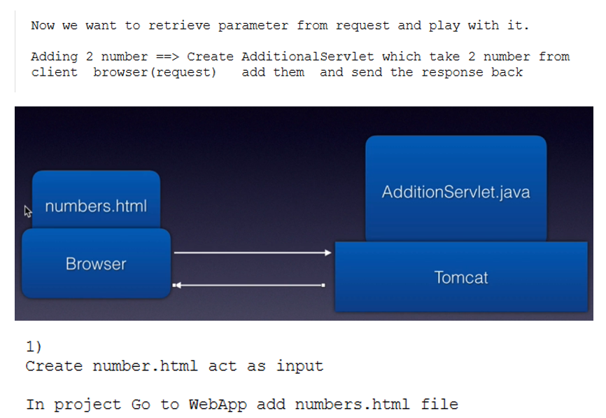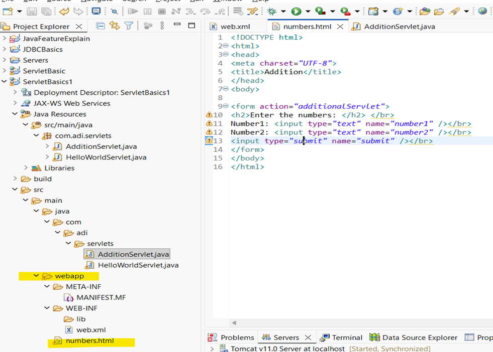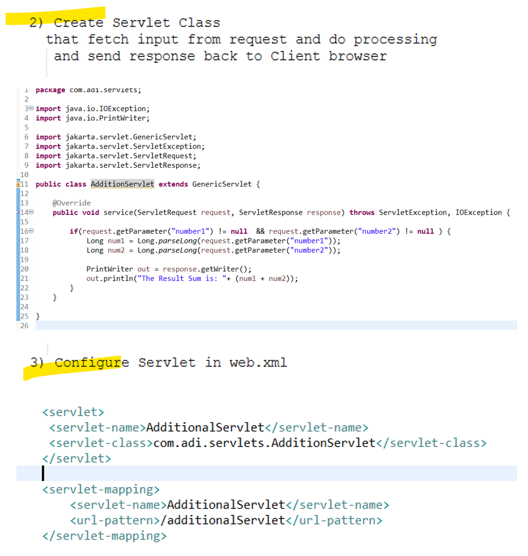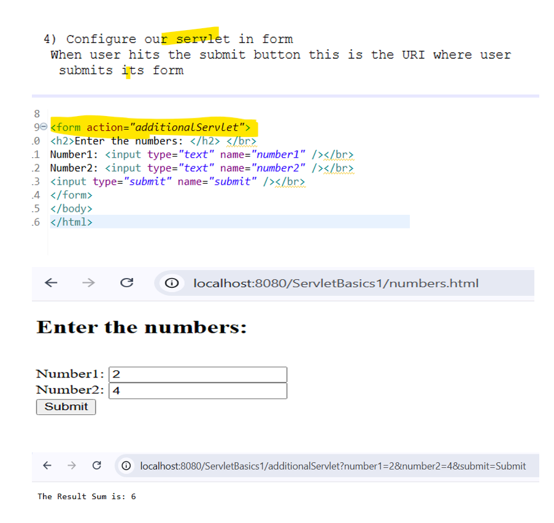
###
```java
public class AdditionServlet extends GenericServlet {

	@Override
	public void service(ServletRequest request, ServletResponse response) throws ServletException, IOException {

		if(request.getParameter("number1") != null  && request.getParameter("number2") != null ) {
			Long num1 = Long.parseLong(request.getParameter("number1"));
			Long num2 = Long.parseLong(request.getParameter("number2"));
			
			PrintWriter out = response.getWriter();
			out.println("The Result Sum is: "+ (num1 + num2));
		}	
	}

}
```
### 
```xml
	<servlet>
	 <servlet-name>AdditionalServlet</servlet-name>
	 <servlet-class>com.adi.servlets.AdditionServlet</servlet-class>
	</servlet>
	
	<servlet-mapping>
		<servlet-name>AdditionalServlet</servlet-name>
		<url-pattern>/additionalServlet</url-pattern>
	</servlet-mapping>
```
### numbers.html
```html
<!DOCTYPE html>
<html>
<head>
<meta charset="UTF-8">
<title>Addition</title>
</head>
<body>

<form action="additionalServlet">
<h2>Enter the numbers: </h2> </br>
Number1: <input type="text" name="number1" /></br>
Number2: <input type="text" name="number2" /></br>
<input type="submit" name="submit" /></br>
</form>
</body>
</html>
```
# ABC
